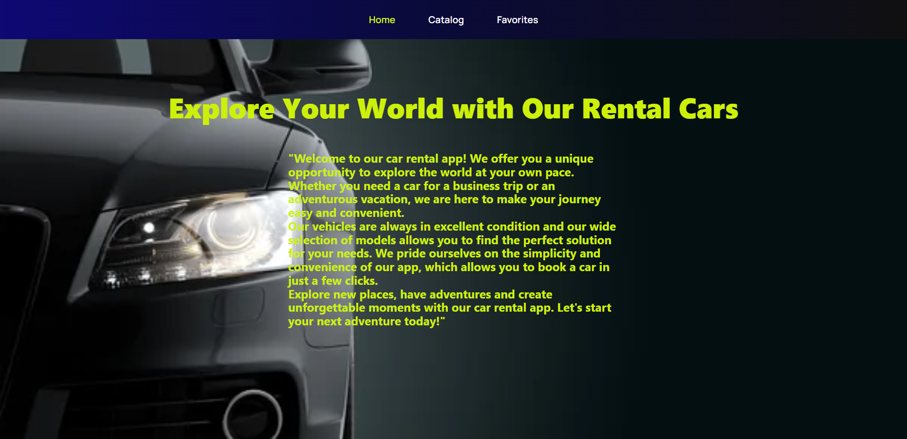
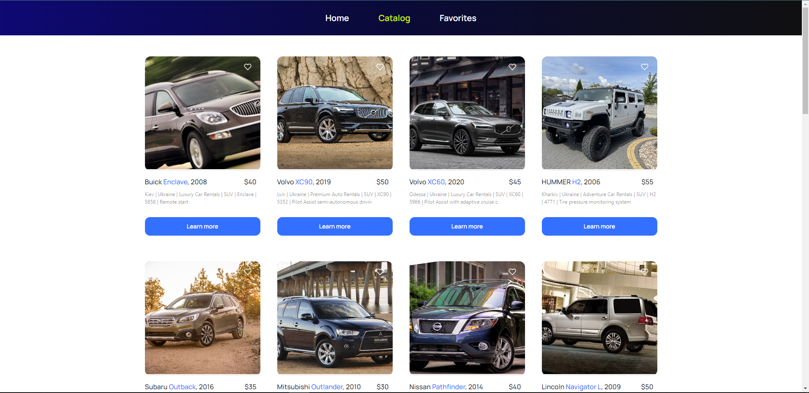
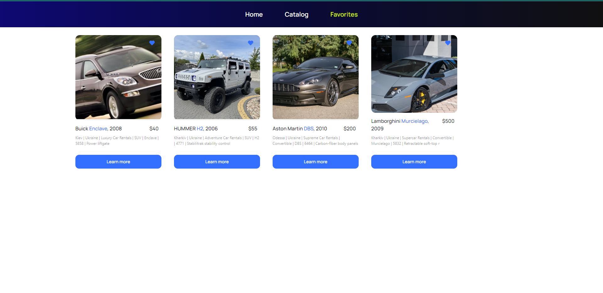

# This app provides a convenient way to find a great rental car with a lot of effort. It differs in the way it is used.

The car rental application includes three main pages:

## Home page

Here the user can get general information about the application.

## Catalog

This page displays vehicles from our database with a brief description and one image. 
The user can click on the map to get more information about the selected car and rent it.

## Favorites:

On this page, the user can save cars that interest him in order to return to them later 
in another session of using the application.

